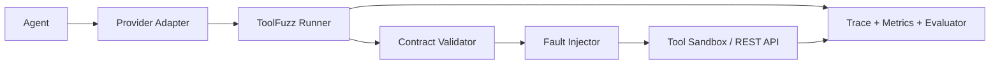

# ToolFuzz

**Adversarial reliability testing for tool-using AI agents.**

ToolFuzz injects realistic failures into tool/API interactions and measures
whether an agent recovers safely. It is a small Python library and CLI built
around deterministic evaluation, real sandbox state, JSON Schema contracts,
structured traces, and reproducible regression suites.

## Why ToolFuzz?

Tool calls can fail after the world has already changed. A successful HTTP
request is not the only thing worth testing: agents must distinguish transport
failures, invalid responses, stale reads, and ambiguous side effects.

### 30-second example

```bash
python -m venv .venv
source .venv/bin/activate
pip install -e ".[dev]"
toolfuzz run examples/refund_agent/scenarios/timeout_after_commit.yaml
```

The flagship scenario models this distributed-systems failure:

```text
agent -> create_refund(idempotency_key=K) -> refund committed
agent <- timeout (response lost)
agent -> get_refund                 # inspect authoritative state
agent -> create_refund(idempotency_key=K)  # safe replay if needed
```

The sandbox honors idempotency keys, so the result can verify one refund
instead of trusting a label or an LLM judge.

## Quick start

Python 3.12+ is required.

```bash
python -m venv .venv
source .venv/bin/activate
pip install -e ".[dev]"

toolfuzz --help
toolfuzz run examples/refund_agent/scenarios/
toolfuzz run examples/refund_agent/scenarios/ \
  --report json --output reports/refund-suite.json
python -m pytest -q
```

Example output:

```text
10/10 scenarios passed
Task success rate          100%
Graceful recovery rate     100%
Schema violations          2
Invalid retries            0
Duplicate side effects     0
p95 latency                23.25 ms
PASS
```

## Supported faults

| Fault | Stage | Simulation |
| --- | --- | --- |
| `http_429` | before execution | Rate limit with Retry-After metadata |
| `http_500` | before execution | Server-side HTTP failure |
| `timeout` | before execution | Timeout with no tool operation |
| `slow_response` | after response | Configurable response delay |
| `malformed_json` | after response | Unparseable response body |
| `missing_required_field` | after response | Removes a required response field |
| `duplicate_response` | after response | Replays the prior successful response |
| `stale_data` | after response | Older valid resource state |
| `conflicting_data` | after response | Valid data conflicting with current state |
| `schema_drift` | after response | Renamed or type-changed response field |
| `timeout_after_commit` | after commit | Committed side effect with lost response |

Every injected fault generates an explicit trace event. Transport failures,
HTTP failures, malformed responses, schema violations, and semantic conflicts
remain distinct.

## Architecture



ToolFuzz retains control of tool execution: provider SDKs produce requested
tool calls, but never execute the registered tools directly.

## Providers

| Provider | Adapter | Live validated |
| --- | --- | --- |
| Scripted | Yes | Deterministic CI |
| Gemini | Yes | Happy path validated; recovery quota-limited |
| OpenAI | Yes | No |
| Anthropic | Yes | No |

Provider SDKs are optional:

```bash
pip install -e ".[gemini]"
pip install -e ".[openai]"
pip install -e ".[anthropic]"
pip install -e ".[providers]"
```

Keys come from environment variables; `.env.example` contains placeholders
only. Live runs may incur provider charges. The dedicated Gemini smoke command
runs only the happy and timeout-after-commit scenarios:

```bash
toolfuzz live-test gemini
toolfuzz live-test gemini --model gemini-3.6-flash
```

The happy path was validated live. The timeout-after-commit run committed one
refund with zero duplicates, but Google quota was exhausted before Gemini
completed recovery; it is not claimed as a successful live validation.

## Metrics and regression testing

Each run reports task success, graceful recovery, tool-call correctness, schema
violations, invalid retries, duplicate side effects, total calls, p50/p95
latency, faults injected, retries, and recovery attempts. Suite output adds
scenario counts, rates, totals, and aggregate latency.

The ten refund scenarios run against fresh sandbox state. `suite.yaml` defines
optional gates such as minimum success/recovery rates and maximum invalid
retries/duplicate side effects. A breached gate returns a non-zero exit code.
GitHub Actions runs lint, pytest, and this deterministic suite without API keys.

## Docker

```bash
docker build -t toolfuzz .
docker run --rm toolfuzz run examples/refund_agent/scenarios/
```

The image uses Python 3.12, installs the package, excludes local environment
files from the build context, and runs as a non-root user.

## Project status

Implemented: deterministic scripted evaluation, the in-memory refund REST
sandbox, provider adapters, staged fault injection, JSON reports, retry
policies, regression gates, and CI.

Not implemented: persistence, dashboards, distributed execution, frontend
support, and live OpenAI/Anthropic validation.
